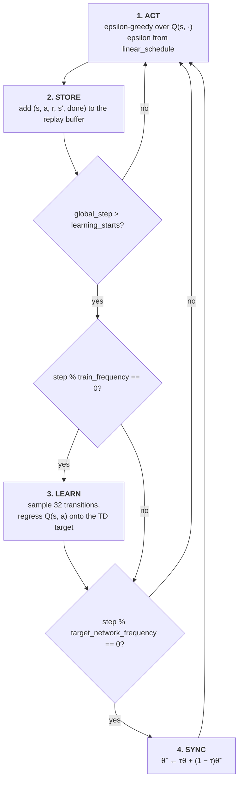

# DQN on Atari

A from-scratch implementation of the **Deep Q-Network** from Mnih et al.,
[*Human-level control through deep reinforcement learning*](https://www.nature.com/articles/nature14236),
Nature 518, 529–533 (2015). The agent learns an action-value function `Q(s, a)` directly from
stacked screen frames, off-policy from a replay buffer, and acts by taking the argmax over it.

This is the Atari counterpart to the PPO projects in this repository. The default game is
`BreakoutNoFrameskip-v4`. Training runs locally or, with one extra flag, on
[Hugging Face Jobs](#training-on-hugging-face-jobs).

---

## The paper in brief

The Nature paper trained one network architecture, with one set of hyperparameters, on 49 Atari
2600 games, seeing only raw pixels, the score, and the set of legal actions. Two changes to plain
Q-learning with a neural network made this stable:

1. **Experience replay.** Transitions `(s, a, r, s')` are stored in a large memory and learned from in
   uniformly sampled minibatches. This breaks the correlation between consecutive samples and reuses
   each transition many times.
2. **A separate target network.** The bootstrap target is computed with a copy of the network whose
   weights `θ⁻` are only refreshed every `C` steps, so the network is not regressing onto a target
   that moves with every gradient step.

The loss at iteration `i` is

```math
L_i(\theta_i) = \mathbb{E}_{(s,a,r,s') \sim U(D)} \Big[ \big( r + \gamma \max_{a'} Q(s', a'; \theta_i^-) - Q(s, a; \theta_i) \big)^2 \Big]
```

---

## How this implementation works

### Environment preprocessing

`make_env` in [algorithm.py](algorithm.py) builds each environment from the Stable-Baselines3 Atari
wrappers plus Gymnasium's observation wrappers, applied in this order:

| Wrapper | Effect | Paper |
| --- | --- | --- |
| `RecordVideo` | Records episodes of the first environment, with `--capture-video`. | |
| `RecordEpisodeStatistics` | Tracks the return and length of each full game. | |
| `NoopResetEnv(noop_max=30)` | Starts each episode with up to 30 random no-ops. | no-op max 30 |
| `MaxAndSkipEnv(skip=4)` | Repeats each action for 4 frames and max-pools the last two to remove flicker. | action repeat 4 |
| `EpisodicLifeEnv` | Treats a lost life as the end of an episode for learning, without resetting the game. | life loss as terminal |
| `FireResetEnv` | Presses FIRE after reset, for games that need it to start. | |
| `ClipRewardEnv` | Clips rewards to their sign, `{-1, 0, +1}`. | reward clipping |
| `ResizeObservation(84, 84)`, `GrayScaleObservation` | Downsamples to an 84×84 grayscale frame. | 84×84 luminance |
| `FrameStack(4)` | Stacks the last 4 frames as the network input. | history length 4 |

`RecordEpisodeStatistics` sits outside `EpisodicLifeEnv`, so the logged `episodic_return` is the
score of a whole game across all lives, even though learning sees one life as one episode.

### Network

[src/agent.py](src/agent.py) implements the paper's architecture:

```text
input   4 × 84 × 84   (stacked frames, scaled by 1/255)
conv1   32 filters, 8×8, stride 4, ReLU   -> 32 × 20 × 20
conv2   64 filters, 4×4, stride 2, ReLU   -> 64 × 9 × 9
conv3   64 filters, 3×3, stride 1, ReLU   -> 64 × 7 × 7
fc      3136 -> 512, ReLU
out     512 -> n_actions  (one Q value per action)
```

A single forward pass scores every action.

### Training loop



- **Exploration.** `linear_schedule` in [src/agent.py](src/agent.py) anneals epsilon from `--start-e`
  to `--end-e` over the first `exploration_fraction × total_timesteps` steps (1.0 → 0.01 over the
  first 1M steps at the defaults), then holds it.
- **Replay buffer.** [utils.py](utils.py) holds a Stable-Baselines3-style `ReplayBuffer`, created with
  `optimize_memory_usage=True`, which stores each frame stack once and reads `s'` from the next
  slot. This roughly halves memory, which matters at 1M transitions of 4 × 84 × 84 bytes.
  `handle_timeout_termination=False`, and only `terminations` is stored as the done flag, so a
  time-limit truncation keeps its bootstrap.
- **TD target.** Computed under `torch.no_grad()` from the target network:
  `y = r + γ (1 − d) max_a' Q_target(s', a')`. The loss is plain MSE and the optimizer is Adam.
- **Target network.** Synced every `--target-network-frequency` steps once learning has started.
  With the default `--tau 1.0` this is a hard copy, as in the paper.

### Evaluation and upload

With `--save-model`, the weights are written to `runs/{run_name}/{exp_name}.cleanrl_model`. Then
[eval.py](eval.py) reloads them and plays 10 episodes at `epsilon = --end-e`, recording video to
`videos/{run_name}-eval` and logging each return to `eval/episodic_return`.

With `--upload-model` as well, [hugging_face.py](hugging_face.py) creates (or reuses) the model
repository `{hf_entity}/{env_id}-{exp_name}-seed{seed}`. It writes a model card with the mean
evaluation return, and pushes the checkpoint, TensorBoard logs, evaluation videos (the latest as
`replay.mp4`), `algorithm.py`, and the dependency files. Without `--hf-entity` the repository is
created under the account of the logged-in token.

---

## Installation

The project needs **Python 3.10 or 3.11**. `ale-py` 0.8.1, the release that registers the Atari
environments with Gymnasium 0.29, has no wheels for newer Pythons. The local `.venv` is built on
Python 3.11.

On Windows, Python versions are managed with the official Python Install Manager (`py`):

```powershell
py install 3.11                # once
py -V:3.11 -m venv .venv
.venv\Scripts\activate
pip install -r requirements.txt
```

On macOS or Linux:

```bash
python3.11 -m venv .venv
source .venv/bin/activate
pip install -r requirements.txt
```

`requirements.txt` installs the [Hugging Face Jobs launcher](../hf-training-jobs),
`hf-jobs-launch`, from GitHub, pinned to the `hf-jobs-launch-v0.1.0` tag. To work on the launcher
itself, run `pip install -e ../hf-training-jobs` afterwards.

### Why these versions

| Pin | Reason |
| --- | --- |
| `gymnasium[atari,accept-rom-license]==0.29.1` | The code uses the Gymnasium 0.29 API: `GrayScaleObservation`, `FrameStack`, and `infos["final_info"]` / `infos["final_observation"]`. Gymnasium 1.0 renamed or removed all of them. The extras install `shimmy`, `ale-py`, and the Atari ROMs. |
| `ale-py==0.8.1` | Newer releases target Gymnasium 1.x. Limits Python to ≤ 3.11. |
| `numpy==1.26.4` | Gymnasium 0.29's environment checker uses `np.bool8`, which NumPy 2 removed. |
| `stable-baselines3==2.3.2` | Last line compatible with Gymnasium 0.29; provides the Atari wrappers. |
| `opencv-python-headless` | Needed by `ResizeObservation`. The headless build avoids the `libGL` dependency missing from the Jobs image. |
| `moviepy==1.0.3` | Gymnasium 0.29's `RecordVideo` is written against the MoviePy 1.x API. |
| `setuptools` | Supplies `distutils` for `from distutils.util import strtobool`. |

A plain `pip install` on Windows gets the CPU build of PyTorch. To train locally on an NVIDIA GPU,
reinstall `torch` from the CUDA index on the PyTorch site. The Linux wheels used in Jobs include
CUDA.

---

## Running

Run from this directory, because `algorithm.py` uses flat imports (`from utils import ...`).

```bash
python algorithm.py
python algorithm.py --env-id PongNoFrameskip-v4 --seed 7
python algorithm.py --track --wandb-project-name dqn-atari --save-model --upload-model --hf-entity byamasupatrick
tensorboard --logdir runs
```

Runs are written to `runs/{env_id}__{exp_name}__{seed}__{timestamp}/`, and every flag is recorded in
the TensorBoard `hyperparameters` text panel.

---

## Training on Hugging Face Jobs

Add `--hf-job` to any command above to run it on Hugging Face instead of this machine:

```bash
python algorithm.py --track --wandb-project-name dqn-atari --save-model --upload-model \
    --hf-entity byamasupatrick --hf-job --hf-flavor l4x1
```

The Job runs and is billed under the `baobabtech` organization, logs to your W&B account, and
uploads the model to your own Hugging Face account. The training code is unchanged; the only
hook is the first line of the `__main__` block in [algorithm.py](algorithm.py):

```python
launch()  # with --hf-job, submits this run to Hugging Face Jobs and exits
```

Without `--hf-job`, or with `--hf-job false`, `launch()` returns immediately and training runs
locally.

Before a full run, check the setup with a dry run and then a short Job:

```bash
python algorithm.py --track --save-model --upload-model --hf-job --hf-dry-run
python algorithm.py --track --save-model --upload-model --total-timesteps 50000 \
    --learning-starts 10000 --hf-job --hf-timeout 30m --hf-follow
```

See [hf-training-jobs](../hf-training-jobs) for the other `--hf-*` flags, where outputs are stored,
and how to monitor or cancel a Job.

---

## Command-line reference

Boolean flags accept a bare flag (`--track`) or an explicit value (`--track false`).

### Experiment setup

| Flag | Default | Description |
| --- | --- | --- |
| `--exp-name` | file name (`algorithm`) | Name of this experiment; part of the run directory and model repository names. |
| `--seed` | `1` | Seeds Python, NumPy, Torch, and the env action spaces. |
| `--torch-deterministic` | `True` | Sets `torch.backends.cudnn.deterministic`. |
| `--cuda` | `True` | Use CUDA when available. |
| `--track` | `False` | Mirror metrics to Weights & Biases. |
| `--wandb-project-name` | `dqn-atari` | W&B project. |
| `--wandb-entity` | `mscsr000324-must` | W&B team/entity. |
| `--capture-video` | `False` | Record training episodes from the first environment. |
| `--save-model` | `False` | Save the weights, then evaluate them for 10 episodes. |
| `--upload-model` | `False` | Push the saved model to the Hugging Face Hub. Requires `--save-model`. |
| `--hf-entity` | `""` | Hub user or org for the model repository; empty means the token's account. |

### Algorithm

| Flag | Default | Description |
| --- | --- | --- |
| `--env-id` | `BreakoutNoFrameskip-v4` | Gymnasium environment id. Must have a **discrete** action space. |
| `--total-timesteps` | `10000000` | Total environment steps. |
| `--learning-rate` | `1e-4` | Adam learning rate. |
| `--num-envs` | `1` | Parallel environments. |
| `--buffer-size` | `1000000` | Replay memory capacity in transitions. |
| `--gamma` | `0.99` | Discount factor. |
| `--tau` | `1.0` | Target network update rate; `1.0` is a hard copy. |
| `--target-network-frequency` | `1000` | Steps between target network updates. |
| `--batch-size` | `32` | Transitions sampled from the buffer per update. |
| `--start-e` | `1` | Initial epsilon. |
| `--end-e` | `0.01` | Final epsilon, also used during evaluation. |
| `--exploration-fraction` | `0.10` | Fraction of `--total-timesteps` over which epsilon is annealed. |
| `--learning-starts` | `80000` | Step at which gradient updates begin. |
| `--train-frequency` | `4` | Steps between gradient updates. |

### Defaults compared with the paper

Values from the paper's hyperparameter table (Extended Data Table 1). One environment step here is
4 emulator frames.

| Quantity | Paper | This implementation |
| --- | --- | --- |
| Minibatch size | 32 | 32 |
| Replay memory size | 1,000,000 | 1,000,000 |
| Agent history length | 4 | 4 |
| Action repeat | 4 | 4 |
| Discount factor | 0.99 | 0.99 |
| Update frequency | every 4 actions | every 4 steps |
| Target network update | every 10,000 updates | every 1,000 steps |
| Optimizer | RMSProp, lr 0.00025 | Adam, lr 1e-4 |
| Loss | squared error with the error clipped to `[-1, 1]` | plain MSE |
| Initial / final exploration | 1.0 / 0.1 | 1.0 / 0.01 |
| Final exploration frame | 1,000,000 | step 1,000,000 |
| Replay start size | 50,000 | 80,000 |
| No-op max | 30 | 30 |
| Training length | 50 million frames | 10 million steps (40 million frames) |

The defaults follow the CleanRL Atari DQN setup, which is why the optimizer, final epsilon, target
update interval, and replay start size differ from the paper.

---

## Metrics

| Scalar | Meaning |
| --- | --- |
| `charts/episodic_return` | Score of each completed game (all lives, unclipped rewards). |
| `charts/episodic_length` | Length of each completed game in steps. |
| `charts/SPS` | Steps per second. Logged every 100 steps once learning has started. |
| `losses/td_loss` | MSE between the TD target and `Q(s, a)`. Jumps when the target network syncs. |
| `losses/q_values` | Mean predicted Q of the taken actions. Steady growth is healthy; a fast blow-up indicates overestimation. |
| `eval/episodic_return` | Return of each evaluation episode, with `--save-model`. |

---

## Layout

```text
dqn-atari/
├── algorithm.py        # arguments, env wrappers, and the training loop (entry point)
├── src/
│   └── agent.py        # QNetwork (Nature DQN) and the epsilon schedule
├── utils.py            # ReplayBuffer and its base classes
├── eval.py             # evaluation of a saved checkpoint
├── hugging_face.py     # model card generation and Hub upload
├── pyproject.toml      # Poetry dependency declaration, plus the `hub` extra
└── requirements.txt    # pip-installable pins, including the Jobs launcher
```

---

## References

- Mnih et al., *Human-level control through deep reinforcement learning* (2015).
  [Nature 518, 529–533](https://www.nature.com/articles/nature14236)
- Mnih et al., *Playing Atari with Deep Reinforcement Learning* (2013).
  [arXiv:1312.5602](https://arxiv.org/abs/1312.5602)
- van Hasselt et al., *Deep Reinforcement Learning with Double Q-learning* (2015).
  [arXiv:1509.06461](https://arxiv.org/abs/1509.06461)
- Machado et al., *Revisiting the Arcade Learning Environment* (2018).
  [arXiv:1709.06009](https://arxiv.org/abs/1709.06009)

## License

MIT, see [LICENSE](../LICENSE) at the repository root. This directory is original work;
provenance for the repository as a whole is recorded in [NOTICE](../NOTICE).
