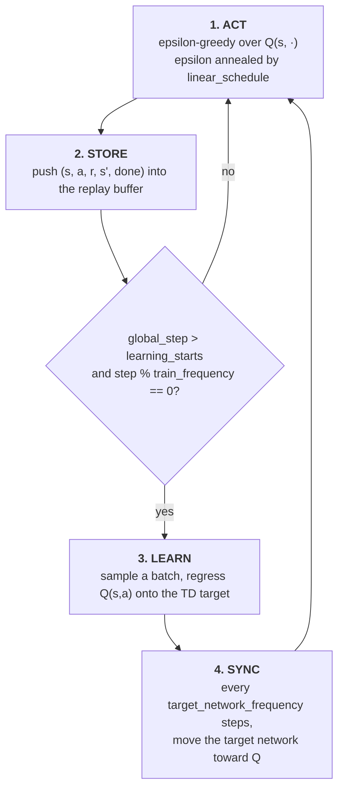

# DQN Implementation

A from-scratch implementation of **Deep Q-Networks** ([Mnih et al.,
2015](https://www.nature.com/articles/nature14236)), the value-based counterpart to the PPO
projects in this repository. Where PPO learns a policy directly from fresh on-policy rollouts, DQN
learns an action-value function `Q(s, a)` off-policy from a replay buffer, and acts by taking the
argmax over it.

Default task is `CartPole-v1`.

---

## How this differs from the PPO projects

| | PPO (`../ppo/`) | DQN (here) |
| --- | --- | --- |
| Family | on-policy policy gradient | off-policy value-based |
| What is learned | a stochastic policy plus a value function | a single action-value function |
| Data | fresh rollout, discarded after use | replay buffer, transitions reused many times |
| Action selection | sample from the policy | argmax over Q, with epsilon-greedy noise |
| Exploration | entropy bonus on the policy | epsilon annealed from 1.0 to 0.05 |
| Stability device | clipped surrogate trust region | a slowly-updated target network |
| Network | separate actor and critic, Tanh | one Q network, ReLU |
| Update trigger | every rollout boundary | every `train-frequency` steps after `learning-starts` |

---

## Layout

```text
dqn/
├── algorithm.py       # arguments, Q network, and the training loop (entry point)
├── utils.py           # ReplayBuffer and its base classes
├── eval.py            # greedy evaluation of a saved checkpoint
├── hugging_face.py    # optional model-card generation and Hub upload
├── pyproject.toml     # metadata (incomplete, see Installation)
└── requirements.txt   # pinned freeze (incomplete, see Installation)
```

---

## Installation

```bash
cd dqn
python -m venv .venv
.venv\Scripts\activate        # Windows
# source .venv/bin/activate   # macOS / Linux
pip install -r requirements.txt
```

Core pins are `torch` 2.13.0, `gymnasium` 1.3.0, and `stable-baselines3` 2.9.0.

`requirements.txt` also carries `huggingface_hub` and `tenacity`, which only the
`--upload-model` path needs.

One caveat: `pyproject.toml` is still a copy of the one in `ppo/`, down to the project name, so
`requirements.txt` is the only usable install path.

---

## Quick start

```bash
cd dqn
python algorithm.py
tensorboard --logdir runs
```

Run it from this directory. `algorithm.py` does `from utils import ReplayBuffer`, a flat import that
only resolves when `dqn/` is the working directory.

```bash
python algorithm.py --env-id Acrobot-v1 --total-timesteps 200000 --seed 7
python algorithm.py --save-model                    # train, then evaluate the checkpoint
```

Runs are written to `runs/{env_id}__{exp_name}__{seed}__{timestamp}/`.

---

## How training works

DQN has no rollout or update phase split. It is a single loop over environment steps, with learning
gated on step counters.



### Acting

Epsilon decays linearly from `--start-e` to `--end-e` over the first
`exploration_fraction × total_timesteps` steps, then stays flat. At the defaults that is 1.0 down to
0.05 across the first 250,000 of 500,000 steps. With probability epsilon a uniform random action is
taken; otherwise the argmax of the Q values.

### The TD target

Sampled batches are regressed onto a one-step bootstrapped target computed under `torch.no_grad()`:

$$
y = r + \gamma \, (1 - d) \max_{a'} Q_{\mathrm{target}}(s', a')
$$

$$
L = \big(y - Q_\theta(s, a)\big)^2
$$

The `max` over next-state actions is what makes this off-policy: the target assumes greedy
continuation regardless of what the behaviour policy actually did. `Q(s, a)` is read out with
`gather` on the action that was taken, and the loss is a plain MSE.

The `(1 - d)` factor drops the bootstrap at terminal states. Only `terminations` is stored as the
done flag, so a time-limit truncation is recorded as non-terminal and keeps its bootstrap, which is
what the paired `handle_timeout_termination=False` on the buffer expects.

### The target network

`Q_target` is a second copy of the network, initialized from the same weights and updated only every
`--target-network-frequency` steps:

$$
\theta_{\mathrm{target}} \leftarrow \tau \, \theta + (1 - \tau) \, \theta_{\mathrm{target}}
$$

With the default `--tau 1.0` this is a **hard copy**, which is the original DQN behaviour. Values
below 1.0 give Polyak averaging instead. The point of the delay either way is that regressing onto a
target that moves with every gradient step is unstable, because the network chases its own output.

### The Q network

```text
obs -> 120 -> 84 -> n_actions,  ReLU activations
```

One network emitting one Q value per discrete action, so a single forward pass scores every action.
Unlike the PPO agents in this repository there is no orthogonal initialization and no separate
trunks, and the optimizer is Adam at PyTorch's default `eps` rather than the `1e-5` PPO uses.

---

## Command-line reference

### Experiment setup

| Flag | Default | Description |
| --- | --- | --- |
| `--exp-name` | `dqn` | Name of this experiment; part of the run directory name. |
| `--seed` | `1` | Seeds Python, NumPy, Torch, and the env spaces. |
| `--torch-deterministic` | `True` | Sets `torch.backends.cudnn.deterministic`. |
| `--cuda` | `True` | Use CUDA when available. |
| `--track` | `False` | Mirror metrics to Weights & Biases. |
| `--wandb-project-name` | `cleanRL` | W&B project. |
| `--wandb-entity` | `None` | W&B team/entity. |
| `--capture-video` | `False` | Record episodes from the first environment. |
| `--save-model` | `False` | Save the checkpoint, then run greedy evaluation on it. |
| `--upload-model` | `False` | Push the saved model to the Hugging Face Hub. |
| `--hf-entity` | `""` | Hub user or org for the model repository. |

### Algorithm

| Flag | Default | Description |
| --- | --- | --- |
| `--env-id` | `CartPole-v1` | Gymnasium environment id. Must have a **discrete** action space. |
| `--total-timesteps` | `500000` | Total environment steps. |
| `--learning-rate` | `2.5e-4` | Adam learning rate. |
| `--num-envs` | `1` | Parallel environments. The replay buffer is sized from this, so it is safe to raise. |
| `--buffer-size` | `10000` | Replay memory capacity in transitions. |
| `--gamma` | `0.99` | Discount factor. |
| `--tau` | `1.0` | Target network update rate; `1.0` is a hard copy. |
| `--target-network-frequency` | `500` | Steps between target network updates. |
| `--batch-size` | `128` | Transitions sampled from the buffer per update. |
| `--start-e` | `1` | Initial epsilon. |
| `--end-e` | `0.05` | Final epsilon. |
| `--exploration-fraction` | `0.5` | Fraction of `--total-timesteps` over which epsilon is annealed. |
| `--learning-starts` | `10000` | Step at which gradient updates begin. |
| `--train-frequency` | `10` | Steps between gradient updates. |

At the defaults this works out to `(500000 - 10000) / 10 = 49,000` gradient updates and 980 target
network syncs, with epsilon reaching its floor at step 250,000.

All flags are also written into the TensorBoard `hyperparameters` text panel, so a run directory
records the configuration that produced it.

---

## Evaluation and upload

With `--save-model`, the state dict is written to
`runs/{run_name}/{exp_name}.cleanrl_model`, then [eval.py](eval.py) reloads it and plays 10 episodes
at `epsilon = --end-e` rather than fully greedy, logging each return to `eval/episodic_return`.

With `--upload-model` as well, [hugging_face.py](hugging_face.py) generates a model card and pushes
the checkpoint, TensorBoard logs, and videos to `{hf_entity}/{env_id}-{exp_name}-seed{seed}`.

---

## Metrics

| Scalar | Meaning |
| --- | --- |
| `charts/episodic_return` | Return per completed episode. |
| `charts/episodic_length` | Episode length; on CartPole it equals the return. |
| `charts/SPS` | Steps per second. Logged every 100 gradient steps. |
| `losses/td_loss` | MSE between the TD target and `Q(s, a)`. Does not decrease monotonically, because the target moves whenever the target network syncs. |
| `losses/q_values` | Mean predicted Q of the taken actions. Steady growth is the healthiest signal; a fast blow-up indicates value overestimation. |

Nothing is logged before `--learning-starts`, since no updates happen yet.

---

## Vector environment autoreset

The environments are constructed with `autoreset_mode=AutoresetMode.SAME_STEP`, which is **not** the
Gymnasium default, and the choice matters for an off-policy algorithm.

Gymnasium 1.0 reworked vector autoreset. Under the default `NEXT_STEP` mode, a sub-environment that
terminates returns its terminal observation, and then the *following* step returns the reset
observation with zero reward and no termination flags. That following transition is an artefact of
resetting rather than something the environment actually did, so writing it into a replay buffer
teaches the agent a transition that does not exist.

`SAME_STEP` resets within the same step instead. Every transition returned is real, so the buffer
can be appended to unconditionally on every step, at any `--num-envs`. The cost is that `next_obs`
is then the *new* episode's first observation, so the true terminal state has to be recovered from
`infos["final_obs"]` before the transition is stored. That substitution is applied on termination
and truncation alike: on truncation the TD target still bootstraps and must see the real final
state, and on termination the `(1 - d)` factor masks the bootstrap out anyway.

Episode statistics follow the same layout. `SyncVectorEnv` flattens nested info dicts into per-key
arrays, each paired with a `_key` boolean mask over environments, so the return of the episode that
just finished in environment `idx` is `infos["final_info"]["episode"]["r"][idx]`, guarded by
`infos["final_info"]["_episode"][idx]`.

**Remaining rough edge:** `from utils import ReplayBuffer` and the deferred `from eval import
evaluate` are flat imports, so `dqn/` has to be the working directory.

## What changed in the arguments

`parse_args` previously carried the full PPO argument set. Thirteen flags that the DQN loop never
reads were removed: `--num-steps`, `--annealing-lr`, `--gae`, `--gae-lambda`, `--num-minibatches`,
`--update-epochs`, `--norm-adv`, `--clip-coef`, `--clip-vloss`, `--ent-coef`, `--vf-coef`,
`--max-grad-norm`, and `--target-kl`, along with the derived `minibatch_size`.

Twelve flags the loop *does* read but which had never been defined were added: `--buffer-size`,
`--tau`, `--target-network-frequency`, `--batch-size`, `--start-e`, `--end-e`,
`--exploration-fraction`, `--learning-starts`, `--train-frequency`, `--save-model`,
`--upload-model`, and `--hf-entity`.

`--gym-id` was also renamed `--env-id`, matching how the save and upload paths already referred to
it. Note that this differs from the three PPO directories, which use `--gym-id`.

`--batch-size` is now an independent flag. Under the PPO argument set it had been derived as
`num_envs × num_steps`, which is a rollout size and has no meaning as a replay sample size.

---

## References

- Mnih et al., *Human-level control through deep reinforcement learning* (2015). [Nature 518, 529-533](https://www.nature.com/articles/nature14236)
- Mnih et al., *Playing Atari with Deep Reinforcement Learning* (2013). [arXiv:1312.5602](https://arxiv.org/abs/1312.5602)
- van Hasselt et al., *Deep Reinforcement Learning with Double Q-learning* (2015). [arXiv:1509.06461](https://arxiv.org/abs/1509.06461)

## License

MIT, see [LICENSE](../LICENSE) at the repository root. This directory is original work;
provenance for the repository as a whole is recorded in [NOTICE](../NOTICE).
