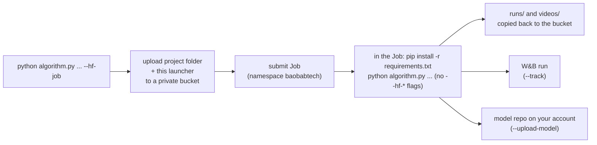

# Hugging Face Jobs launcher

Run any training script in this repository on [Hugging Face Jobs](https://huggingface.co/docs/huggingface_hub/guides/jobs)
by adding one flag to the command you already use. The same command without the flag trains on the
local machine.

```bash
python algorithm.py --track --save-model --upload-model            # trains here
python algorithm.py --track --save-model --upload-model --hf-job   # trains on Hugging Face
```

Jobs run and are billed under the [baobabtech](https://huggingface.co/baobabtech) organization.
Everything the training script writes to the Hub (the model repository from `--upload-model`) goes
to the account of whoever is logged in locally, because the Job authenticates with that person's
token.

---

## Adding it to a project

1. Add the launcher to the project's `requirements.txt`, as a path relative to the project folder:

   ```text
   -e ../hf-training-jobs
   ```

2. Call `launch()` as the first line of the script's `__main__` block, before the script parses its
   own arguments:

   ```python
   from hf_jobs import launch

   if __name__ == "__main__":
       launch()  # with --hf-job, submits this run to Hugging Face Jobs and exits
       args = parse_args()
   ```

Nothing else in the script changes. `launch()` removes every `--hf-*` flag from `sys.argv` before
returning, so the script's own parser never sees them. [dqn-atari](../dqn-atari) is set up this way.

---

## What happens on `--hf-job`



1. The folder containing the script, and this `hf-training-jobs` folder, are uploaded to the private
   bucket `baobabtech/hf-training-jobs`, under a new subfolder per run
   (`{project}-{UTC timestamp}-{random}`). `.venv`, `runs`, `videos`, `wandb`, `.git`, and
   `__pycache__` are skipped.
2. A Job is submitted in the `baobabtech` namespace with that subfolder mounted at `/bucket`.
3. Inside the Job, the code is copied to local disk, `requirements.txt` is installed, and the script
   runs with exactly the arguments you gave it, minus the `--hf-*` flags. Since `--hf-job` is gone,
   `launch()` does nothing there and the script trains normally.
4. When the script exits, successfully or not, `runs/` and `videos/` are copied to
   `/bucket/outputs`, so TensorBoard logs and checkpoints survive the Job.
5. The local command prints the Job URL and exits.

### Credentials

Two secrets are passed to the Job, both read from the local machine:

| Secret | Source | Used for |
| --- | --- | --- |
| `HF_TOKEN` | `hf auth login` | Mounting the bucket, and `--upload-model` pushing to your account. |
| `WANDB_API_KEY` | `WANDB_API_KEY` env var, else `~/_netrc` / `~/.netrc` written by `wandb login` | `--track`. |

Your token must be allowed to run Jobs in `baobabtech` and to write repositories in your own
account. A fine-grained token needs both scopes; a classic *write* token has them.

---

## Flags

| Flag | Default | Description |
| --- | --- | --- |
| `--hf-job` | `False` | Submit to Hugging Face Jobs. Leave it off, or pass `--hf-job false`, to train locally. |
| `--hf-namespace` | `baobabtech` | User or organization the Job runs and is billed under. |
| `--hf-flavor` | `t4-small` | Hardware. See `hf jobs hardware`, e.g. `cpu-upgrade`, `t4-small`, `a10g-small`, `l4x1`. |
| `--hf-timeout` | `24h` | Maximum Job duration, e.g. `90m`, `12h`. The Job is stopped when it is reached. |
| `--hf-image` | `python:3.11` | Docker image. 3.11 because `ale-py` 0.8.1 has no newer wheels. |
| `--hf-follow` | `False` | Stream the Job logs in the terminal until it finishes. |
| `--hf-dry-run` | `False` | Print the file list, secrets (names only), and Job script, then exit without uploading. |

The defaults live at the top of [hf_jobs/launcher.py](hf_jobs/launcher.py).

---

## Watching and managing Jobs

```bash
hf jobs ps --namespace baobabtech                  # running Jobs
hf jobs logs <job-id> --namespace baobabtech       # logs
hf jobs inspect <job-id> --namespace baobabtech    # status and settings
hf jobs cancel <job-id> --namespace baobabtech     # stop it
```

Outputs are in the bucket, under the run's subfolder. To list runs and download one run's outputs:

```bash
hf buckets ls baobabtech/hf-training-jobs
hf buckets sync hf://buckets/baobabtech/hf-training-jobs/<run-subfolder>/outputs ./outputs
```

---

## Cost

Jobs are billed per minute while they run, to `baobabtech`. `hf jobs hardware` lists current prices.
A full 10M-step DQN run takes hours, so try a short run first (for example
`--total-timesteps 50000 --hf-timeout 30m`) to check that installs, W&B, and the upload all work.
