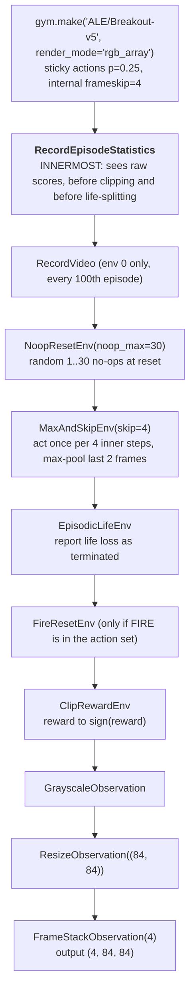

# PPO for Atari

PPO scaled up from classic control to the **Arcade Learning Environment**. The learning algorithm
is unchanged from [../ppo/](../ppo/); what changes is everything around it: a convolutional policy
over stacked grayscale frames, the standard Atari preprocessing pipeline, and an evaluation setup
following the protocols recommended by
[Machado et al., 2017](https://arxiv.org/abs/1709.06009).

Built on **Gymnasium 1.3.0** with `ale-py` 0.12.1, not the original `gym`. That distinction shows up
throughout the wrapper stack, since the wrapper names and the observation shapes changed at the
Gymnasium 1.0 boundary. See [Gymnasium, not gym](#gymnasium-not-gym).

---

## Table of contents

- [Relationship to `ppo/`](#relationship-to-ppo)
- [Repository layout](#repository-layout)
- [Installation](#installation)
- [Quick start](#quick-start)
- [Preprocessing pipeline](#preprocessing-pipeline)
- [Gymnasium, not gym](#gymnasium-not-gym)
- [The agent](#the-agent)
- [Hyperparameters](#hyperparameters)
- [Evaluation protocol](#evaluation-protocol)
- [Reading the metrics](#reading-the-metrics)
- [Known issues](#known-issues)
- [References](#references)

---

## Relationship to `ppo/`

The optimization code is **byte-identical** to [../ppo/algorithm.py](../ppo/algorithm.py): the same
GAE recursion, the same clipped surrogate, the same clipped value loss, the same minibatch loop.
For the algorithm itself, including the equations mapped to line numbers, read
**[../ppo/README.md](../ppo/README.md)**. This document covers only what differs.

The complete set of differences:

| | `ppo/` | `ppo-atari/` |
| --- | --- | --- |
| Network | two separate MLP trunks | one shared CNN trunk, two linear heads |
| Activation | Tanh | ReLU |
| Layers | `Linear` only | `Conv2d` stack, then `Linear` |
| Observation | low-dimensional state vector | `(4, 84, 84)` uint8 frame stack, scaled by `1/255` |
| Default env | `CartPole-v1` | `ALE/Breakout-v5` |
| `--total-timesteps` | 25,000 | 10,000,000 |
| `--num-envs` | 4 | 8 |
| `--clip-coef` | 0.2 | 0.1 |
| Wrappers | `RecordEpisodeStatistics` only | full Atari preprocessing stack |
| Extra imports | none | `ale_py`, five `stable_baselines3` Atari wrappers |

Nothing else in the training loop changes.

---

## Repository layout

```text
ppo-atari/
├── algorithm.py       # argument parsing, env construction, and the PPO training loop
├── src/
│   └── agent.py       # Agent: shared Nature-CNN trunk with actor and critic heads
├── pyproject.toml     # Poetry dependency declaration
├── requirements.txt   # pip-installable freeze of the same versions
├── runs/              # TensorBoard event files, one directory per run (gitignored)
└── videos/            # recorded episode MP4s, one directory per run (gitignored)
```

---

## Installation

Either path works and both resolve the same pinned versions.

```bash
cd ppo-atari
poetry install
```

```bash
cd ppo-atari
python -m venv .venv
.venv\Scripts\activate        # Windows (PowerShell / cmd)
# source .venv/bin/activate   # macOS / Linux
pip install -r requirements.txt
```

`pyproject.toml` sets `package-mode = false`, since `algorithm.py` is run directly rather than
installed as a package, so `poetry install` resolves dependencies only.

### Key dependencies

| Package | Version | Role |
| --- | --- | --- |
| `torch` | 2.13.0 | CNN, autograd, optimizer |
| `gymnasium` | 1.3.0 | environment API, vectorization, observation wrappers |
| `ale-py` | 0.12.1 | Arcade Learning Environment, registers the `ALE/*` ids |
| `stable-baselines3` | 2.9.0 | the five Atari-specific wrappers |
| `opencv-python` | 5.0.0.93 | frame resizing backend |
| `tensorboard` | 2.21.0 | local metric logging |
| `wandb` | 0.28.2 | optional remote tracking |

ROMs ship with `ale-py` 0.12, so there is no separate `AutoROM` step.

---

## Quick start

```bash
cd ppo-atari
python algorithm.py                      # ALE/Breakout-v5, 10M steps
tensorboard --logdir runs
```

`algorithm.py` imports `from src.agent import Agent`, so run it from the `ppo-atari/` directory.

A different game, or a shorter run to check the plumbing:

```bash
python algorithm.py --gym-id ALE/Pong-v5 --total-timesteps 1000000 --seed 42
python algorithm.py --total-timesteps 50000 --num-envs 4        # smoke test
```

**This is a long job.** At the defaults it is 10M agent steps across 8 environments, and on CPU it
runs for days rather than hours. A CUDA device is close to mandatory for a full run; the code
selects one automatically when available.

---

## Preprocessing pipeline

Raw ALE frames are 210x160 RGB at 60 Hz, which is neither the resolution nor the frame rate a
convolutional policy wants. `make_env` composes eleven wrappers to reduce that to a
`(4, 84, 84)` uint8 stack ([algorithm.py:118-147](algorithm.py#L118-L147)).

Wrappers compose outward, so the first applied is the **innermost** and sees raw emulator steps,
while the last applied is what the agent actually talks to. The order is load-bearing:



Two consequences of that ordering are worth spelling out, because they are the difference between
logging a meaningful score and logging a meaningless one:

- **`RecordEpisodeStatistics` is applied first**, so it sits *inside* both `ClipRewardEnv` and
  `EpisodicLifeEnv`. What lands in `charts/episodic_return` is therefore the **true unclipped game
  score over a full game with all lives**, not the sign-clipped per-life signal the agent trains
  on. This is what you want for reporting, and it is what Machado et al. ask for. Had the wrapper
  been applied last, the logged number would have been clipped per-life reward counts.
- **`charts/episodic_length` counts inner-env steps, not agent steps.** The counter increments once
  per call to the env it wraps, and `MaxAndSkipEnv` makes four such calls per agent action, so the
  logged length is roughly four times the number of decisions the agent actually made.

`FireResetEnv` is applied conditionally because only some games (Breakout among them) require
pressing FIRE to launch, and applying it where FIRE is not in the action set would crash.

---

## Gymnasium, not gym

This is written against Gymnasium 1.3, and several things in the pipeline differ from the `gym`-era
code that most published Atari PPO implementations were written against:

| Concern | Original `gym` | Gymnasium 1.x, used here |
| --- | --- | --- |
| Grayscale wrapper | `GrayScaleObservation` | `GrayscaleObservation` (lowercase `s`) |
| Frame stacking | `FrameStack`, returns `LazyFrames` | `FrameStackObservation`, returns a real array |
| Stacked shape | needs manual transpose to channels-first | already `(4, 84, 84)`, channel-first |
| Episode stats | `RecordEpisodeStatistics(env)` | `RecordEpisodeStatistics(env, stats_key="episode")` |
| Step return | 4-tuple with a single `done` | 5-tuple, `terminated` and `truncated` split |
| Env registration | `import gym` was enough | `import ale_py` required to register `ALE/*` ids |
| Env ids | `BreakoutNoFrameskip-v4` | `ALE/Breakout-v5` |

The `FrameStackObservation` change is the convenient one: because it yields `(4, 84, 84)` directly,
no `np.array(...).transpose(...)` is needed before the tensor hits `Conv2d`, which older
implementations all carried.

The `import ale_py` line ([algorithm.py:7](algorithm.py#L7)) looks unused to a linter but is not.
Importing it runs the registration side effect that makes `ALE/Breakout-v5` resolvable.

---

## The agent

[src/agent.py](src/agent.py) implements the **Nature DQN convolutional encoder** with a PPO
actor-critic head on top. The structural change from `ppo/` is not only Conv2d and ReLU: the trunk
is now **shared** between actor and critic, where `ppo/` keeps two entirely separate MLPs.

```text
input (4, 84, 84) uint8, divided by 255.0 in the forward pass
  Conv2d(4  -> 32, kernel 8, stride 4)   ReLU      -> (32, 20, 20)
  Conv2d(32 -> 64, kernel 4, stride 2)   ReLU      -> (64,  9,  9)
  Conv2d(64 -> 64, kernel 3, stride 1)   ReLU      -> (64,  7,  7)
  Flatten                                          -> 3136
  Linear(3136 -> 512)                    ReLU      -> 512
      |
      +-- actor:  Linear(512 -> n_actions)   orthogonal gain 0.01
      +-- critic: Linear(512 -> 1)           orthogonal gain 1.0
```

Design choices and why each one is what it is:

- **Conv2d instead of Linear.** The observation is an image, so weight sharing across spatial
  positions is what makes learning from 7056 pixels per frame tractable at all. Flattening
  `(4, 84, 84)` into an MLP would need roughly 28k inputs on the first layer.
- **ReLU instead of Tanh.** Tanh saturates, and the three-layer classic-control MLP in `ppo/` is
  shallow enough that this does not matter. This trunk is five layers deep, and the non-saturating
  gradient of ReLU is what keeps it trainable. This pairing (ReLU with convolutions, Tanh with
  small MLPs) is the standard split in the PPO literature rather than an arbitrary choice.
- **Shared trunk.** Learning a separate visual encoder for the critic would roughly double both the
  parameter count and the forward cost, for features that are largely the same. The heads stay
  separate so the two objectives cannot collapse into one another.
- **`x / 255.0` inside `forward`.** Frames stay uint8 in the environment and the replay buffer, and
  are scaled to `[0, 1]` only on the way into the network. Note that this means both `get_value`
  and `get_action_and_value` apply the scaling, so callers must always pass **raw** uint8-valued
  observations, never pre-scaled ones.
- **Head initialization.** Orthogonal init with gain `sqrt(2)` on hidden layers, `0.01` on the
  policy head so the initial action distribution is near-uniform, and `1.0` on the value head. Same
  scheme as `ppo/`.

The shapes `Conv2d(4, ...)` and `Linear(64 * 7 * 7, 512)` are **hardcoded**, so the network only
accepts exactly 4 stacked 84x84 frames. Changing `FrameStackObservation(4)` or the resize target
requires editing [src/agent.py](src/agent.py) to match.

---

## Hyperparameters

Only four defaults differ from `ppo/`. Every other flag is identical, and the full reference is in
[../ppo/README.md](../ppo/README.md#command-line-reference).

| Flag | `ppo/` | here | Why |
| --- | --- | --- | --- |
| `--gym-id` | `CartPole-v1` | `ALE/Breakout-v5` | v5 ids carry the Machado defaults, see below |
| `--total-timesteps` | 25,000 | 10,000,000 | Atari needs millions of frames to move at all |
| `--num-envs` | 4 | 8 | more parallel envs to decorrelate a slow simulator |
| `--clip-coef` | 0.2 | 0.1 | the tighter trust region the PPO paper used for Atari |

Derived quantities at the defaults:

```text
batch_size      = num_envs × num_steps          # 8 × 128 = 1024
minibatch_size  = batch_size // num_minibatches # 1024 // 4 = 256
num_updates     = total_timesteps // batch_size # 10000000 // 1024 = 9765
gradient_steps  = num_updates × update_epochs × num_minibatches   # 9765 × 4 × 4 = 156240
actual env steps = num_updates × batch_size     # 9999360, just short of 10M
```

The rollout observation buffer is `(128, 8, 4, 84, 84)` float32, roughly **110 MiB resident on the
training device**, because the buffer is allocated as float32 rather than uint8. That matches the
reference implementations, but it is the single largest allocation in the script and it scales
linearly with `--num-envs` and `--num-steps`.

---

## Evaluation protocol

`ALE/*-v5` environment ids exist specifically to default to the protocol recommended by
Machado et al. Reading the registered spec for `ALE/Breakout-v5` gives:

| Setting | Value | Purpose |
| --- | --- | --- |
| `repeat_action_probability` | `0.25` | **sticky actions**, the paper's headline proposal for injecting stochasticity into a deterministic emulator |
| `max_num_frames_per_episode` | `108000` | the 30-minute cap at 60 Hz, so a stuck agent cannot run forever |
| `frameskip` | `4` | the emulator already skips frames internally |
| `full_action_space` | `False` | minimal per-game action set rather than the full 18 |

Sticky actions matter because without them an Atari policy can win by memorizing a single
open-loop action sequence, which measures rote recall rather than the general competency the
benchmark is meant to test. Getting this for free from the `v5` id is the main reason to prefer it
over the older `BreakoutNoFrameskip-v4`.

Three places where the setup **departs** from the paper's recommendations, worth knowing when
comparing numbers against published results:

- **`EpisodicLifeEnv` uses the life counter.** Machado et al. argue against giving the agent the
  life signal, on the grounds that it is game-specific information a general agent should not
  depend on. Using it is long-standing DQN-lineage practice and it does speed up early learning,
  but it is a departure. Logging is unaffected, since `RecordEpisodeStatistics` sits inside this
  wrapper and still reports whole-game scores.
- **`NoopResetEnv` is redundant here.** Random no-op starts were the older answer to emulator
  determinism, and the paper's position is that sticky actions supersede them. Running both is
  harmless but the no-ops are no longer doing meaningful work.
- **Minimal action set.** `full_action_space=False` means results are not directly comparable to
  agents evaluated on the shared 18-action space.

---

## Reading the metrics

The scalar names and the caveat about last-minibatch logging are identical to `ppo/`; see
[../ppo/README.md](../ppo/README.md#reading-the-metrics). What differs is how to read them here:

| Scalar | On Atari |
| --- | --- |
| `charts/episodic_return` | The true unclipped game score over a full game. On Breakout, expect 1 to 2 for a long while before it moves; a trained PPO reaches the low hundreds. |
| `charts/episodic_length` | In inner-env steps, so about 4x the agent's decision count. Not directly comparable to `ppo/`. |
| `charts/SPS` | The number to watch first. On CPU this will be low enough that a full run is impractical, and it is the fastest way to confirm CUDA is actually being used. |
| `losses/entropy` | Starts near `log(n_actions)`, so about 1.39 for Breakout's 4 actions. A fast collapse means the policy committed early. |
| `losses/explained_variance` | Slow to rise on Atari. Clipped rewards make returns hard to predict early, so low values in the first million steps are expected rather than alarming. |

Because rewards are sign-clipped for training but not for logging, `losses/value_loss` and
`charts/episodic_return` are on **different scales** and should not be compared to each other.

---

## Known issues

**Frameskip is applied twice, giving 16 frames per action instead of 4.**

This is the one to fix before trusting any results. `ALE/Breakout-v5` already sets `frameskip=4`
internally, and [algorithm.py:133](algorithm.py#L133) then wraps it in `MaxAndSkipEnv(skip=4)`.
The two multiply: measuring emulator frame counts through the stack gives **16.0** frames per agent
step, against 4.0 with `MaxAndSkipEnv` removed.

What that costs:

- The agent acts at about **3.75 Hz instead of 15 Hz**. In Breakout the ball crosses a large part of
  the screen in 16 frames, so the paddle cannot react in time and achievable score is capped by the
  control rate, not by the learning algorithm.
- `--total-timesteps 10000000` becomes **160M emulator frames**, four times the game-time of a
  standard 10M-step run, so published step-count comparisons do not line up.
- `MaxAndSkipEnv` max-pools the last two frames of its window to cancel Atari sprite flicker. Those
  two frames are now 4 emulator frames apart rather than adjacent, so the flicker removal it exists
  to provide no longer works as intended.

The fix that keeps the Machado defaults is to disable the emulator's internal skip and let the
wrapper own it:

```python
env = gym.make(gym_id, frameskip=1, render_mode="rgb_array")
```

Switching to `BreakoutNoFrameskip-v4` would also give a total skip of 4, but that id sets
`repeat_action_probability=0.0`, so it silently gives up sticky actions.

**`render_mode="rgb_array"` is always passed**, even when `--capture-video` is off
([algorithm.py:120](algorithm.py#L120)), so the emulator produces an RGB frame on every single step
of every environment for the entire run. On Atari that is a real throughput cost. It should be
conditional on video capture being requested.

**Inherited from `ppo/`,** since the training loop is unchanged. All four are described in
[../ppo/README.md](../ppo/README.md#scope-and-known-deviations): `approx_kl` and `clipfrac`
computed inside the autograd graph, `--target-kl` only breaking after a full epoch, `terminated`
and `truncated` merged into one flag, and `clipfracs` being reassigned rather than appended. The
merged-done issue bites harder here, because the 108,000-frame cap makes truncation a routine event
rather than a rare one.

**No lockfile.** `requirements.txt` is a `pip freeze`, not a resolved lock, and there is no
`poetry.lock`, so a fresh install is not byte-reproducible.

---

## References

- Machado et al., *Revisiting the Arcade Learning Environment: Evaluation Protocols and Open Problems for General Agents* (2017). [arXiv:1709.06009](https://arxiv.org/abs/1709.06009)
- Bellemare et al., *The Arcade Learning Environment: An Evaluation Platform for General Agents* (2013). [arXiv:1207.4708](https://arxiv.org/abs/1207.4708)
- Mnih et al., *Human-level control through deep reinforcement learning* (2015). [Nature 518, 529-533](https://www.nature.com/articles/nature14236)
- Schulman et al., *Proximal Policy Optimization Algorithms* (2017). [arXiv:1707.06347](https://arxiv.org/abs/1707.06347)
- Huang et al., *The 37 Implementation Details of Proximal Policy Optimization* (2022). [ICLR Blog Track](https://iclr-blog-track.github.io/2022/03/25/ppo-implementation-details/)

## License

MIT, see [LICENSE](../LICENSE) at the repository root. This directory is original work;
provenance for the repository as a whole is recorded in [NOTICE](../NOTICE).
