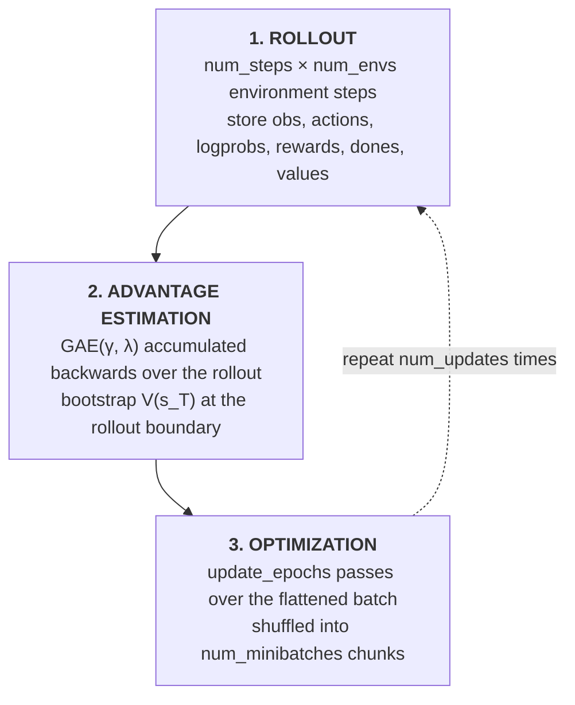

# PPO Implementation

A from-scratch re-implementation of **Proximal Policy Optimization** (PPO), the policy-gradient
algorithm of [Schulman et al., 2017](https://arxiv.org/abs/1707.06347). The goal is not to be a
general-purpose RL library but to reproduce and study the core algorithm through a single readable
training loop: policy and value networks, the clipped surrogate objective, generalized advantage
estimation (GAE), vectorized trajectory collection, and minibatch updates, with every moving part
exposed as a command-line flag so training dynamics can be ablated one detail at a time.

The implementation follows the CleanRL single-file style: the entire algorithm lives in
[algorithm.py](algorithm.py), and only the network definition is factored out into
[src/agent.py](src/agent.py).

---

## Table of contents

- [Repository layout](#repository-layout)
- [Installation](#installation)
- [Quick start](#quick-start)
- [How training works](#how-training-works)
- [The agent](#the-agent)
- [Command-line reference](#command-line-reference)
- [Logging and monitoring](#logging-and-monitoring)
- [Video capture](#video-capture)
- [Reading the metrics](#reading-the-metrics)
- [Scope and known deviations](#scope-and-known-deviations)
- [References](#references)

---

## Repository layout

```text
ppo/
├── algorithm.py       # argument parsing + the full PPO training loop (entry point)
├── src/
│   └── agent.py       # Agent: separate actor/critic MLPs, orthogonal init
├── pyproject.toml     # Poetry project definition and pinned dependencies
├── poetry.lock        # resolved dependency graph (Poetry 2.1.3)
├── requirements.txt   # pip-installable freeze of the same environment
├── runs/              # TensorBoard event files, one directory per run (gitignored)
└── videos/            # recorded episode MP4s, one directory per run (gitignored)
```

`runs/`, `videos/`, `wandb/`, and `__pycache__/` are all excluded by the repository
[.gitignore](../.gitignore), so experiment output never lands in version control.

---

## Installation

Requires **Python >= 3.10, < 3.14**.

### With Poetry (recommended)

```bash
cd ppo
poetry install --no-root
```

`--no-root` installs only the dependencies. The `[tool.poetry]` section declares a `ppo` package
under `src/`, but the code is currently laid out as a flat script plus `src/agent.py`, so there is
no distributable package to build. The training loop is invoked directly as a script.

### With pip

```bash
cd ppo
python -m venv .venv
.venv\Scripts\activate        # Windows (PowerShell / cmd)
# source .venv/bin/activate   # macOS / Linux
pip install -r requirements.txt
```

### Key dependencies

| Package | Version | Role |
| --- | --- | --- |
| `torch` | 2.13.0 | networks, autograd, optimizer |
| `gymnasium` | 1.3.0 | environments, vectorization, episode-statistics and video wrappers |
| `tensorboard` | 2.21.0 | local metric logging (`runs/`) |
| `wandb` | 0.28.2 | optional remote experiment tracking |
| `moviepy` + `pygame` | 2.2.1 / 2.6.1 | rendering and MP4 encoding for `--capture-video` |
| `stable-baselines3` | 2.9.0 | reference implementation for comparison |

CUDA is used automatically when available; pass `--cuda False` to force CPU.

---

## Quick start

Train on the default environment (`CartPole-v1`, 25k timesteps, roughly a minute on CPU):

```bash
cd ppo
python algorithm.py
```

`algorithm.py` imports `from src.agent import Agent`, so it must be run from the `ppo/` directory
(or with `ppo/` on `PYTHONPATH`).

Watch the run live in TensorBoard:

```bash
tensorboard --logdir runs
```

A longer run on a different environment, with more parallel envs:

```bash
python algorithm.py --gym-id Acrobot-v1 --total-timesteps 500000 --num-envs 8 --seed 42
```

Track to Weights & Biases and record video:

```bash
export WANDB_API_KEY=<your-key>     # $env:WANDB_API_KEY = "<your-key>" in PowerShell
python algorithm.py --track --capture-video --wandb-project-name ppo-study
```

Every run writes to a directory named `{gym_id}__{exp_name}__{seed}__{unix_timestamp}`, e.g.
`runs/CartPole-v1__ppo__1__1787446634/`.

---

## How training works

One **iteration** of the loop consists of three stages, repeated
`num_updates = total_timesteps // batch_size` times.



### Batch arithmetic

The batch shape is derived, not configured ([algorithm.py:74-75](algorithm.py#L74-L75)):

```text
batch_size      = num_envs × num_steps          # 4 × 128  = 512
minibatch_size  = batch_size // num_minibatches # 512 // 4 = 128
num_updates     = total_timesteps // batch_size # 25000 // 512 = 48
gradient_steps  = num_updates × update_epochs × num_minibatches  # 48 × 4 × 4 = 768
```

Because `num_updates` uses integer division, the actual number of environment steps is
`num_updates × batch_size`, which can be slightly less than `--total-timesteps`.

### 1. Rollout

`num_envs` copies of the environment run in lockstep under
[`gym.vector.SyncVectorEnv`](algorithm.py#L128-L131). For `num_steps` steps the agent samples an
action, and the observation, action, log-probability, reward, done flag, and value estimate are
written into pre-allocated `(num_steps, num_envs)` tensors on the training device. Actions are
sampled under `torch.no_grad()`, and the log-probabilities stored here become the *old* policy
$\pi_{\theta_\mathrm{old}}(a \mid s)$ that the surrogate objective ratios against.

Environments are wrapped in `RecordEpisodeStatistics`, so completed episodes surface their return
and length in the `info` dict; these are logged as they arrive rather than averaged over the
iteration.

Terminations and truncations are merged into a single `done` signal
([algorithm.py:186](algorithm.py#L186)). See [Scope and known deviations](#scope-and-known-deviations).

### 2. Generalized advantage estimation

With `--gae True` (the default), advantages are accumulated backwards through the rollout
([algorithm.py:200-212](algorithm.py#L200-L212)):

$$
\begin{aligned}
\delta_t &= r_t + \gamma\, V(s_{t+1})\,(1 - d_{t+1}) - V(s_t) \\\
\hat{A}_t &= \delta_t + \gamma \lambda\,(1 - d_{t+1})\,\hat{A}_{t+1} \\\
R_t &= \hat{A}_t + V(s_t)
\end{aligned}
$$

where $d_t$ is the done flag and $R_t$ is the bootstrapped return the critic regresses onto.
The $(1 - d)$ factor cuts the recursion at episode boundaries. At the final step of the rollout
the loop bootstraps with a fresh forward pass $V(s_T)$ on the incoming observation, so a truncated
rollout does not bias the estimate.

Setting `--gae False` selects the classic Monte-Carlo alternative
([algorithm.py:214-224](algorithm.py#L214-L224)): discounted returns are accumulated backwards and
advantages become the raw residual $\hat{A}_t = R_t - V(s_t)$. This is the $\lambda = 1$ end of the
bias-variance trade-off, and exists specifically so the two can be compared under identical settings.

### 3. Optimization

The `(num_steps, num_envs)` tensors are flattened to a flat batch, then for `update_epochs`
passes the batch indices are shuffled and consumed in `minibatch_size` chunks. For each minibatch
($\hat{\mathbb{E}}_t$ below denotes the mean over that minibatch):

**Policy loss:** the clipped surrogate objective, with the ratio computed in log-space for
numerical stability:

$$
\rho_t(\theta) = \exp\big(\log \pi_\theta(a_t \mid s_t) - \log \pi_{\theta_\mathrm{old}}(a_t \mid s_t)\big)
$$

$$
L^{\mathrm{policy}} = -\hat{\mathbb{E}}_t\Big[\min\big(\rho_t(\theta)\,\hat{A}_t,\;\; \mathrm{clip}(\rho_t(\theta),\, 1-\epsilon,\, 1+\epsilon)\,\hat{A}_t\big)\Big]
$$

Taking `torch.max` of the two *negated* terms ([algorithm.py:258-260](algorithm.py#L258-L260)) is
the minimization-form equivalent of the paper's `min` over the un-negated objective.

With `--norm-adv True` (default), advantages are standardized **per minibatch**, not per batch,
matching the reference implementations.

**Value loss:** mean-squared error against the GAE returns, optionally clipped to a trust region
around the old value estimate ([algorithm.py:264-275](algorithm.py#L264-L275)):

$$
L^{\mathrm{value}} = \tfrac{1}{2}\,\hat{\mathbb{E}}_t\Big[\max\big((V_\theta(s_t) - R_t)^2,\;\; (V_{\mathrm{old}}(s_t) + \mathrm{clip}(V_\theta(s_t) - V_{\mathrm{old}}(s_t),\, -\epsilon,\, +\epsilon) - R_t)^2\big)\Big]
$$

Note that the value-clipping range reuses `--clip-coef`, the same $\epsilon$ as the policy clip.

**Entropy bonus:** the mean policy entropy is subtracted from the loss to discourage premature
determinism.

**Total loss** ([algorithm.py:278](algorithm.py#L278)):

$$
L = L^{\mathrm{policy}} - c_{\mathrm{ent}}\, H[\pi_\theta] + c_{\mathrm{vf}}\, L^{\mathrm{value}}
$$

Gradients are clipped to `--max-grad-norm` (global L2 norm) before each Adam step. Adam uses
`eps=1e-5` rather than the PyTorch default `1e-8`, a detail that measurably affects PPO stability.

**Learning-rate annealing:** with `--annealing-lr True` (default), the learning rate decays
linearly from `--learning-rate` to 0 across the run: $\eta_t = \big(1 - \frac{t-1}{N_\mathrm{updates}}\big)\,\eta_0$.

**KL early stopping:** if `--target-kl` is set, the update loop breaks out after any epoch whose
approximate KL exceeds the threshold, capping how far the policy moves per iteration. Disabled by
default (`None`).

---

## The agent

[src/agent.py](src/agent.py) defines two **separate** (non-shared) MLP trunks:

| | Architecture | Head initialization |
| --- | --- | --- |
| **Actor** | `obs → 64 → 64 → n_actions`, Tanh activations | orthogonal, gain `0.01` |
| **Critic** | `obs → 64 → 64 → 1`, Tanh activations | orthogonal, gain `1.0` |

All hidden layers use orthogonal initialization with gain `√2` and zero bias. The small `0.01` gain
on the policy head is deliberate: it makes the initial action distribution close to uniform, so the
agent starts with high entropy and no accidental early commitment to one action.

The actor emits logits over a `Categorical` distribution. Two entry points:

- `get_value(obs)`: critic only, used for rollout bootstrapping.
- `get_action_and_value(obs, action=None)`: returns `(action, log_prob, entropy, value)`. Passing
  `action=None` samples a fresh action (rollout); passing a stored action re-evaluates it under the
  current policy (optimization).

---

## Command-line reference

All flags are also recorded verbatim into the TensorBoard `hyperparameters` text panel, so any run
directory is self-documenting.

### Experiment setup

| Flag | Default | Description |
| --- | --- | --- |
| `--exp-name` | `ppo` | Experiment name; becomes part of the run directory name. |
| `--gym-id` | `CartPole-v1` | Gymnasium environment id. Must have a **discrete** action space. |
| `--seed` | `1` | Seeds Python, NumPy, Torch, and each env's action/observation spaces. |
| `--total-timesteps` | `25000` | Total environment steps (rounded down to a multiple of `batch_size`). |
| `--torch-deterministic` | `True` | Sets `torch.backends.cudnn.deterministic`. |
| `--cuda` | `True` | Use CUDA when available; `False` forces CPU. |

### Rollout collection

| Flag | Default | Description |
| --- | --- | --- |
| `--num-envs` | `4` | Parallel environments in the synchronous vector env. |
| `--num-steps` | `128` | Steps collected per environment per iteration. |

### Advantage estimation

| Flag | Default | Description |
| --- | --- | --- |
| `--gae` | `True` | Use GAE; `False` falls back to discounted Monte-Carlo returns. |
| `--gamma` | `0.99` | Discount factor $\gamma$. |
| `--gae-lambda` | `0.95` | GAE trace decay $\lambda$. |

### Optimization

| Flag | Default | Description |
| --- | --- | --- |
| `--learning-rate` | `2.5e-4` | Adam learning rate (`eps=1e-5`). |
| `--annealing-lr` | `True` | Linearly anneal the learning rate to 0 over training. |
| `--num-minibatches` | `4` | Minibatches per epoch; sets `minibatch_size`. |
| `--update-epochs` | `4` | Passes (K) over each collected batch. |
| `--norm-adv` | `True` | Standardize advantages within each minibatch. |
| `--clip-coef` | `0.2` | Surrogate clipping coefficient $\epsilon$ (also the value-clipping range). |
| `--clip-vloss` | `True` | Use the clipped value-loss variant from the paper. |
| `--ent-coef` | `0.01` | Entropy bonus coefficient. |
| `--vf-coef` | `0.5` | Value-loss coefficient. |
| `--max-grad-norm` | `0.5` | Global gradient-norm clip. |
| `--target-kl` | `None` | If set, stop the update early once approximate KL exceeds it. |

### Tracking

| Flag | Default | Description |
| --- | --- | --- |
| `--track` | `False` | Mirror TensorBoard metrics to Weights & Biases. |
| `--wandb-project-name` | `cleanRL` | W&B project. |
| `--wandb-entity` | `None` | W&B team/entity. |
| `--capture-video` | `False` | Record episodes from the first environment. See below. |

Boolean flags accept an explicit value (`--track True`, `--gae False`) or act as a switch when
given bare (`--track` sets it to `True`).

---

## Logging and monitoring

Metrics always go to TensorBoard under `runs/{run_name}`:

```bash
tensorboard --logdir runs
```

With `--track`, W&B is initialized with `sync_tensorboard=True`, so the same scalars are forwarded
upstream. There is no separate logging path. The full config is captured via `config=vars(args)`
and the source is uploaded with `save_code=True`. Authenticate by exporting `WANDB_API_KEY` or
running `wandb login` beforehand.

---

## Video capture

`--capture-video` wraps environment index 0 in `gym.wrappers.RecordVideo` with
`episode_trigger=lambda x: x % 100 == 0`, recording every 100th episode to
`videos/{run_name}/rl-video-episode-N.mp4`.

The video directory is only supplied when `--track` is also set
([algorithm.py:120](algorithm.py#L120)), so use the two flags together:

```bash
python algorithm.py --track --capture-video
```

---

## Reading the metrics

| Scalar | What it tells you |
| --- | --- |
| `charts/episodic_return` | The headline number. Logged per completed episode, not averaged. |
| `charts/episodic_length` | Episode length; on CartPole it tracks return exactly. |
| `charts/learning_rate` | Confirms the annealing schedule is being applied. |
| `charts/SPS` | Throughput in steps per second. Useful for spotting a device misconfiguration. |
| `losses/policy_loss` | The clipped surrogate. Hovers near zero and is *not* a progress signal on its own. |
| `losses/value_loss` | Critic regression error. Should trend down as returns become predictable. |
| `losses/entropy` | Policy entropy. A healthy run decays gradually; a collapse to ~0 early means premature convergence; raise `--ent-coef`. |
| `losses/approx_kl` | $\mathbb{E}\big[(\rho - 1) - \log \rho\big]$, a low-variance KL estimator. Sustained values above ~0.02 mean each update is moving the policy too far. |
| `losses/clipfrac` | Fraction of samples hitting the clip boundary. Large values (>0.3) mean the ratio is routinely saturating the trust region. |
| `losses/explained_variance` | $1 - \operatorname{Var}(R - V) / \operatorname{Var}(R)$. Near 1 means the critic explains the returns; near or below 0 means it is no better than predicting the mean. |

**Caveat on the loss scalars:** `policy_loss`, `value_loss`, `entropy`, `approx_kl`, and `clipfrac`
are recorded once per iteration from whichever variable is left in scope after the update loop,
i.e. the **last minibatch of the last epoch**, not a mean across the update. They are usable as
trend indicators but are noisier than a properly averaged statistic would be.

---

## Scope and known deviations

Deliberate scope limits:

- **Discrete action spaces only.** Asserted at [algorithm.py:133](algorithm.py#L133). Continuous
  control would need a Gaussian policy head with a learned state-independent log-std.
- **Synchronous vectorization.** `SyncVectorEnv` steps environments in-process; there is no
  `AsyncVectorEnv` path, which caps throughput on slow simulators.
- **No observation or reward normalization.** No running mean/variance wrappers, which classic
  control tasks do not need but MuJoCo-style tasks generally do.
- **No checkpointing or evaluation mode.** Training runs start from scratch and the policy is not
  saved; `videos/` is the only artifact of learned behaviour.

Known deviations from the canonical reference implementation, documented rather than silently
patched:

- **`approx_kl` and `clipfrac` are computed inside the autograd graph.** The guarding
  `with torch.no_grad()` at [algorithm.py:249](algorithm.py#L249) is commented out. Both are
  diagnostics that never enter the loss, so the gradients are correct, but the statistics retain
  graph references unnecessarily.
- **KL early stopping only breaks the epoch loop.** The `--target-kl` check sits after the
  minibatch loop ([algorithm.py:285-287](algorithm.py#L285-L287)), so the current epoch always
  completes in full before the break takes effect.
- **`terminated` and `truncated` are merged into one `done` flag.** Time-limit truncations are
  therefore treated as true terminations, and GAE cuts the bootstrap at those boundaries. The
  correct treatment is to bootstrap `V(s_T)` through a truncation; as written, this understates the
  value of states near the time limit.
- **`clipfracs` is reassigned, not appended.** It is rebuilt as a single-element list each
  minibatch ([algorithm.py:251](algorithm.py#L251)), so it never accumulates across the update.

---

## References

- Schulman et al., *Proximal Policy Optimization Algorithms* (2017). [arXiv:1707.06347](https://arxiv.org/abs/1707.06347)
- Schulman et al., *High-Dimensional Continuous Control Using Generalized Advantage Estimation* (2015). [arXiv:1506.02438](https://arxiv.org/abs/1506.02438)
- Huang et al., *The 37 Implementation Details of Proximal Policy Optimization* (2022). [ICLR Blog Track](https://iclr-blog-track.github.io/2022/03/25/ppo-implementation-details/)
- Engstrom et al., *Implementation Matters in Deep RL: A Case Study on PPO and TRPO* (2020). [arXiv:2005.12729](https://arxiv.org/abs/2005.12729)

## License

MIT, see [LICENSE](../LICENSE) at the repository root. This directory is original work;
provenance for the repository as a whole is recorded in [NOTICE](../NOTICE).
